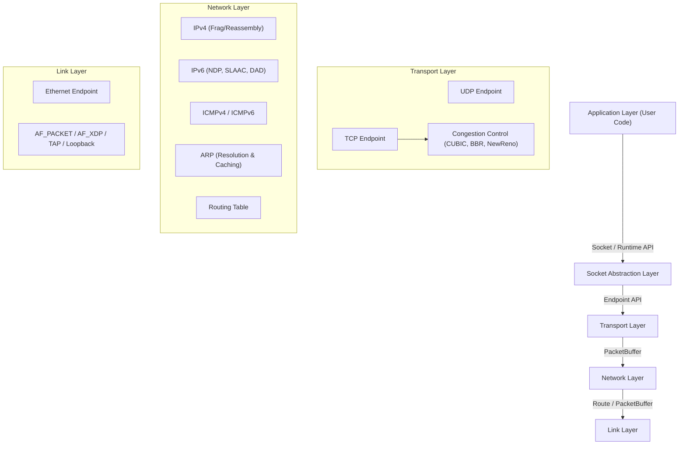

# ustack

A high-performance, user-space TCP/IP network stack implemented in Zig (0.13.0), architecturally inspired by gVisor's Netstack but optimized for Zig's memory management and single-threaded concurrency models.

## 🏗️ Architecture Overview

ustack is designed as a **single-process, single-threaded network stack** utilizing an event loop architecture. This approach eliminates locking overhead and context switching, achieving high performance through:

- **Zero Context Switches**: All operations run on one CPU core.
- **Cache Locality**: Critical data structures remain in L1/L2 cache.
- **Lock-Free Execution**: Event loop serialization eliminates race conditions and lock contention.
- **Zero-Copy Path**: Data is passed through layers using `VectorisedView` scatter-gather buffers.
- **Zero-Allocation Runtime**: Aggressive object pooling (TCP Endpoints, Wait Queues, Packet Headers) ensures a stable memory footprint and eliminates allocator churn under load.



---

## ⚡ Performance Benchmarks

Optimized for Jumbo Frames (MTU 9000) and extreme concurrency scaling using advanced object pooling and event coalescing.

### Throughput & Scaling (veth pair, MTU 9000)

| Scenario | Metric | Result |
| :--- | :--- | :--- |
| **UDP Throughput** | 8900 byte payload | **~9.6 Gbps** (Near line-rate) |
| **TCP Throughput** | 8000 byte payload | **~4.7 Gbps** |
| **Concurrency** | Active Connections | **65,000+** (Stable) |
| **Connection Rate** | TCP Handshakes | **~35,000 CPS** (Recycled) |
| **Event Loop** | Syscall Overhead | **< 5%** (via Coalescing) |

---

## 🛠️ Supported Features

### Core Stack Features
- **Runtime Bootstrap Layer (`src/runtime.zig`)**: Simplifies stack initialization. Provides a `Runtime` struct that manages Stack, NIC, Routes, and Event Multiplexer lifecycles in one place.
- **BSD-Style Socket API (`src/socket.zig`)**: A zero-cost shim providing a familiar `bind`/`connect`/`accept`/`read`/`write` API. It bridges the gap between raw Endpoints and standard programming patterns.
- **Event Coalescing (`src/event_mux.zig`)**: Drastically reduces system call overhead by batching socket notifications into a single `eventfd` write per event loop tick.
- **High Concurrency Scaling**: Support for **65k+ concurrent endpoints** through:
  - **Object Pooling**: Recycles TCP Endpoints and Wait Queues to eliminate allocation spikes.
  - **Pre-warmed Pools**: 32k+ cluster buffers allocated at startup.
  - **Sharded Transport Table**: 256 independent shards for O(1) lookups without contention.
- **Wait Queue Mechanism**: Robust event notification system (`waiter.zig`) for non-blocking asynchronous I/O.
- **Wyhash Implementation**: High-performance hashing for O(1) connection lookups.

### TCP (Transmission Control Protocol)
- **RFC-Compliant State Machine**: Support for all states (LISTEN, SYN-SENT, SYN-RCVD, ESTABLISHED, etc.).
- **High-Performance Extensions (RFC 7323)**: Window Scaling and Timestamps (PAWS/RTT estimation).
- **Selective Acknowledgments (RFC 2018)**: Full **SACK** support for efficient recovery from multiple packet losses.
- **Reliability & Recovery**: RTQ, Fast Retransmit, and Adaptive RTO.
- **Performance Optimizations**: Delayed ACKs, Piggybacked ACKs, MSS Negotiation.
- **Syncache**: Efficiently manages half-open connections with incremental GC to mitigate SYN floods.
- **Modular Congestion Control**: NewReno, CUBIC, and BBR.

### UDP & Network Layers
- **UDP**: Efficient datagram handling with zero-copy read/write.
- **IPv4 Suite**: Header validation, checksums, **Fragmentation**, and **Reassembly**.
- **IPv6 Suite**: NDP (NS/NA/RA), SLAAC, DAD, and RS.
- **ARP**: Dynamic address resolution with link-address caching.
- **ICMPv4/v6**: Echo Request/Reply (Ping) and error notifications (Destination Unreachable, Time Exceeded).

### Drivers & Hardware Integration
- **AF_PACKET**: Optimized for Jumbo Frames with mmap-based zero-copy TX.
- **AF_XDP**: High-speed Express Data Path integration (Linux).
- **TAP Adapter**: Standard virtual ethernet interface support.
- **Loopback**: Native loopback driver for local testing and IPC.

---

## 🚀 Getting Started

### Prerequisites
- **Zig 0.13.0**
- **libev** development headers (for examples)

### Building
```bash
# Build the library (static and shared)
zig build

# Build benchmarking and integration examples
zig build example
```

### Running Benchmarks & Examples
```bash
# Start uperf server (using Runtime API)
./zig-out/bin/example_uperf_runtime veth0 server 10.0.0.2/24 -m 9000

# Start uperf client (using Socket API)
./zig-out/bin/example_uperf_socket veth1 client 10.0.0.1/24 10.0.0.2 -m 9000 -t 10

# Start ping-pong benchmark (CPS measurement)
./zig-out/bin/example_ping_pong_socket veth1 10.0.0.1/24 -c 10.0.0.2 -C 1000 -n 100000
```

---

## 📂 Directory Structure

- `src/runtime.zig`: Bootstrap layer for easy stack initialization.
- `src/socket.zig`: BSD-style socket abstraction layer.
- `src/event_mux.zig`: High-performance event multiplexer with coalescing.
- `src/stack.zig`: Central stack entry point and NIC management.
- `src/transport/`: TCP/UDP protocol implementations and congestion control.
- `src/network/`: IPv4, IPv6, ARP, and ICMP handlers.
- `src/drivers/`: OS-specific interface adapters (AF_PACKET, AF_XDP, TAP, Loopback).
- `src/buffer.zig`: Memory-efficient packet and vectorised view abstractions.
- `src/stats.zig`: Global statistics and latency metrics collection.

---

## ⚖️ License
Distributed under the MIT License. See `LICENSE` for more information.

