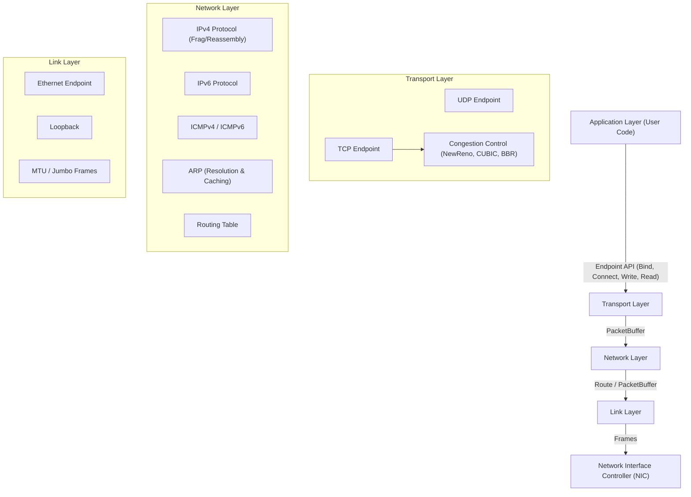
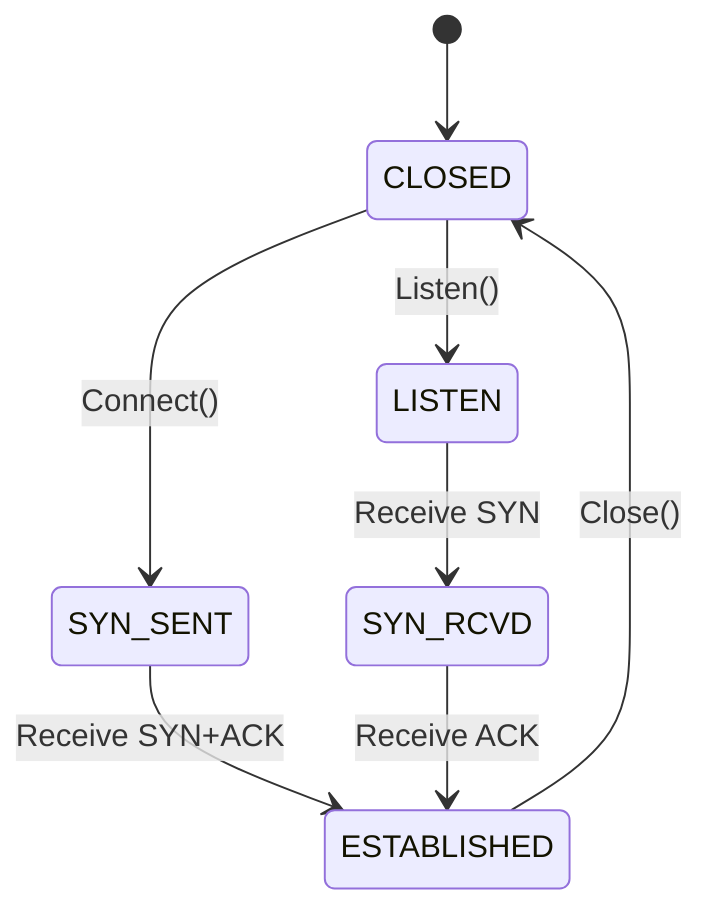

# ustack

A robust, user-space TCP/IP network stack implemented in Zig, ported and adapted from the Go-based Netstack (gVisor).

## 1. High-Level Architecture

The stack follows a modular, layered architecture closely mirroring the TCP/IP model.



## 2. Directory Structure

```
ustack/src/
├── buffer.zig          # Memory management (VectorisedView, Prependable)
├── header.zig          # Protocol header parsing/encoding (Eth, IP, TCP, UDP, ICMP)
├── main.zig            # Entry point and integration tests
├── stack.zig           # Core Stack, NIC, Route, Dispatcher interfaces
├── tcpip.zig           # Common types (Address, Endpoint, Error)
├── waiter.zig          # WaitQueue mechanism for blocking I/O
├── link/
│   └── eth.zig         # Ethernet Link Endpoint implementation
├── network/
│   ├── ipv4.zig        # IPv4 Protocol, Fragmentation, Reassembly
│   ├── ipv6.zig        # IPv6 Protocol
│   ├── arp.zig         # Address Resolution Protocol
│   ├── icmp.zig        # ICMPv4 (Echo)
│   └── icmpv6.zig      # ICMPv6 (Echo)
└── transport/
    ├── udp.zig         # UDP Protocol & Endpoint
    ├── tcp.zig         # TCP Protocol & Endpoint (State Machine)
    └── congestion/     # Pluggable Congestion Control
        ├── control.zig # Interface definition
        ├── cubic.zig   # CUBIC implementation
        └── bbr.zig     # BBR implementation
```

## 3. Low-Level Implementation Details

### 3.1 Memory Management (`buffer.zig`)
*   **VectorisedView**: A non-contiguous buffer abstraction (scatter-gather) used to hold packet data without unnecessary copying. It manages a slice of `View`s (byte slices).
*   **Prependable**: A buffer designed to grow backwards, allowing headers (TCP -> IP -> Ethernet) to be prepended efficiently before transmission.
*   **PacketBuffer**: The primary container passed between layers, holding the header (Prependable) and data (VectorisedView).

### 3.2 Core Stack (`stack.zig`)
*   **Stack**: The central object holding registries for protocols (Transport/Network), NICs, and the Link Address Cache (ARP table).
*   **NIC**: Represents a network interface. It demultiplexes incoming packets to the appropriate Network Protocol (IPv4, IPv6, ARP) based on EtherType.
*   **Dispatcher**: A virtual table interface used to pass packets up the stack (Link -> Network -> Transport).

### 3.3 TCP Implementation (`transport/tcp.zig`)
*   **State Machine**: Full implementation of the TCP State Machine (LISTEN, SYN-SENT, ESTABLISHED, CLOSE-WAIT, etc.).
*   **Reliability**:
    *   **Retransmission Queue**: Tracks unacknowledged segments.
    *   **RTO Timer**: Triggers retransmission based on round-trip time.
    *   **Fast Retransmit**: Detects 3 duplicate ACKs to retransmit immediately.
*   **Congestion Control**: Modular design supporting:
    *   **NewReno**: Standard Slow Start and Congestion Avoidance with Fast Recovery.
    *   **CUBIC**: High-bandwidth delay-product optimization using a cubic function.
    *   **BBR**: Bandwidth-Bottleneck and Round-trip propagation time algorithm.



### 3.4 Network Layer (`network/`)
*   **IPv4**: Supports packet validation, checksum calculation, and dispatching to transport.
    *   **Fragmentation**: Checks MTU and returns error/fragments packets (logic in place).
    *   **Reassembly**: `IPv4Endpoint` maintains a list of fragments and reassembles them upon arrival of the final fragment.
*   **IPv6**: Full header parsing/encoding and dispatching.
*   **ICMP**: Handles Echo Request/Reply (Ping) for both v4 and v6.

## 4. Feature Support

| Feature Category | Feature | Status | Implementation Details |
|------------------|---------|--------|------------------------|
| **Core Architecture** | Zero-Copy I/O | ✅ | `VectorisedView` scatter-gather buffers |
| | Wait Queues | ✅ | Blocking/Notification mechanism in `waiter.zig` |
| | Thread Safety | ✅ | Mutex-protected Endpoints and Queues |
| **Link Layer** | Ethernet II | ✅ | Framing, Parsing, Encoding in `header.zig` |
| | Loopback | ✅ | Supported via `LinkEndpointCapabilities` |
| | MTU / Jumbo Frames | ✅ | Configurable MTU (up to 9KB+), Fragmentation checks |
| | ARP | ✅ | Resolution, Caching, Request/Reply logic |
| **Network Layer** | IPv4 | ✅ | Addressing, Checksums, Validation |
| | IPv4 Fragmentation | ✅ | Detection, Header parsing |
| | IPv4 Reassembly | ✅ | Reassembly list in `IPv4Endpoint`, timeout pending |
| | IPv6 | ✅ | Header parsing, Addressing, Dispatching |
| | ICMPv4 | ✅ | Echo Request/Reply (Ping) |
| | ICMPv6 | ✅ | Echo Request/Reply (Ping6) |
| **Transport Layer** | UDP | ✅ | Bind, Connect, Read, Write (Datagrams) |
| | TCP State Machine | ✅ | Handshake (SYN/ACK), TEARDOWN (FIN), ESTABLISHED |
| | TCP Reliability | ✅ | Retransmission Queue, RTO Timer, Fast Retransmit |
| | TCP Flow Control | ⚠️ | Window management (Basic) |
| | Congestion Control | ✅ | Pluggable: NewReno (default), CUBIC, BBR |
| **API** | Socket Interface | ✅ | `bind`, `listen`, `accept`, `connect`, `read`, `write`, `shutdown` |
| | Dual Stack | ✅ | Seamless IPv4/IPv6 support on same stack instance |

## 5. Key Features

*   **Jumbo Frames**: Configurable MTU support (up to 9000+ bytes) in Link/Ethernet layers.
*   **Zero-Copy capable**: Designed with vectorised I/O principles.
*   **Pluggable Congestion Control**: Switch between NewReno, CUBIC, and BBR at runtime per endpoint.
*   **Dual Stack**: Simultaneous IPv4 and IPv6 support.

## 6. Running Tests

The project includes a comprehensive test suite covering unit logic and integration scenarios (TCP Handshake, Data Transfer, Packet Loss/Recovery).

```bash
# Run all tests
zig test ustack/src/main.zig
```

## 7. Example Usage

```zig
const stack = @import("stack.zig");
const tcpip = @import("tcpip.zig");

// 1. Initialize Stack
var s = try stack.Stack.init(allocator);

// 2. Create NIC
const link_ep = ...; // Your hardware or pipe endpoint
try s.createNIC(1, link_ep);

// 3. Create TCP Endpoint
var ep = try s.transport_protocols.get(6).?.newEndpoint(&s, 0, &wq);

// 4. Bind and Listen
const addr = tcpip.FullAddress{ .nic = 1, .addr = .{ .v4 = .{ 0, 0, 0, 0 } }, .port = 80 };
try ep.bind(addr);
try ep.listen(10);

// 5. Accept connections
while (true) {
    const new_conn = try ep.accept();
    // Handle new_conn.ep
}
```

## 7. Integration Examples

The `examples/` directory contains reference implementations for integrating `ustack` with real-world I/O mechanisms:

*   **`examples/tun_tap_adapter.zig`**: A `LinkEndpoint` implementation for Linux TUN/TAP devices. Shows how to read/write raw Ethernet frames from a file descriptor and bridge them to the stack.
*   **`examples/libuv_integration.zig`**: A conceptual guide on linking `ustack`'s passive event model with the `libuv` event loop. It demonstrates how to map `poll` events to packet ingestion and `timer` events to stack maintenance.
