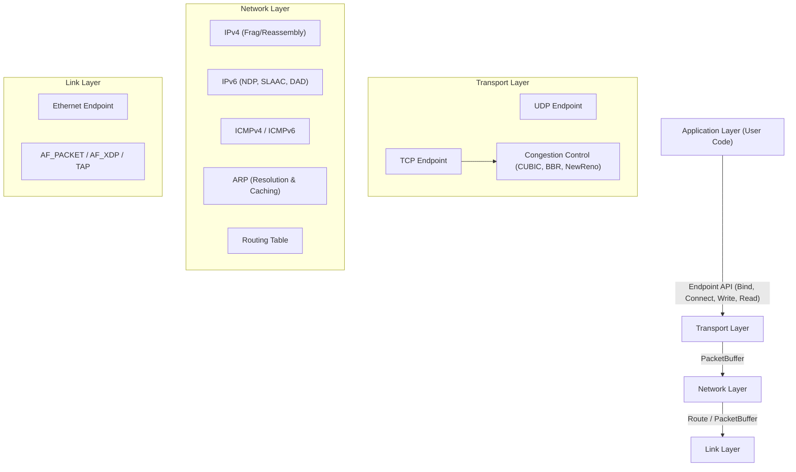

# ustack

A high-performance, user-space TCP/IP network stack implemented in Zig (0.13.0), architecturally inspired by gVisor's Netstack but optimized for Zig's memory management and single-threaded concurrency models.

## 🏗️ Architecture Overview

ustack is designed as a **single-process, single-threaded network stack** utilizing an event loop architecture. This approach eliminates locking overhead and context switching, achieving high performance through:

- **Zero Context Switches**: All operations run on one CPU core.
- **Cache Locality**: Critical data structures remain in L1/L2 cache.
- **Lock-Free Execution**: Event loop serialization eliminates race conditions and lock contention.
- **Zero-Copy Path**: Data is passed through layers using `VectorisedView` scatter-gather buffers.



---

## ⚡ Performance Benchmarks

Optimized for Jumbo Frames (MTU 9000) and high-throughput scenarios using the `AF_PACKET` driver with mmap-based zero-copy transmission.

### Throughput & CPS (veth pair, MTU 9000)

| Protocol | MTU | Payload Size | Throughput / CPS |
| :--- | :--- | :--- | :--- |
| **UDP** | 9000 | 8900 bytes | **~9.6 Gbps** (Near line-rate) |
| **TCP** | 9000 | 8000 bytes | **~4.7 Gbps** |
| **TCP** | 1500 | 1400 bytes | **~1.0 Gbps** |
| **TCP CPS** | 1500 | - | **~10,000 Connections/sec** |
| **UDP PPS** | 1500 | 64 bytes | **~180,000 Packets/sec** |

---

## 🛠️ Supported Features

### Core Stack Features
- **Zero-Copy Architecture**: Uses `VectorisedView` (scatter-gather) and `Prependable` headers to avoid data copies.
- **High Concurrency**: Connection management is partitioned into **256 independent shards**, supporting 10M+ concurrent endpoints.
- **Wait Queue Mechanism**: Robust event notification system (`waiter.zig`) for non-blocking asynchronous I/O.
- **Single-Threaded Event Loop**: Native integration with `libev` and `libuv`.
- **Wyhash Implementation**: High-performance hashing for O(1) connection lookups.

### TCP (Transmission Control Protocol)
- **RFC-Compliant State Machine**: Support for all states (LISTEN, SYN-SENT, SYN-RCVD, ESTABLISHED, FIN-WAIT-1/2, TIME-WAIT, etc.).
- **High-Performance Extensions (RFC 7323)**:
  - **Window Scaling**: Support for large windows via shift counts.
  - **Timestamps**: PAWS (Protect Against Wrapped Sequences) and RTT estimation.
- **Selective Acknowledgments (RFC 2018)**: Full **SACK** support for efficient recovery from multiple packet losses.
- **Reliability & Recovery**:
  - **Retransmission Queue (RTQ)**: Precise tracking of unacknowledged segments.
  - **Fast Retransmit**: Detects 3 duplicate ACKs for immediate recovery.
  - **RTO Timer**: Adaptive retransmission timeouts.
- **Performance Optimizations**:
  - **Delayed ACKs (RFC 1122)**: Reduces control traffic by up to 50%.
  - **Piggybacked ACKs**: Attaches ACKs to outgoing data segments automatically.
  - **Syncache**: Efficiently manages half-open connections to mitigate SYN flood attacks.
  - **MSS Negotiation**: Dynamic Maximum Segment Size discovery.
- **Modular Congestion Control**:
  - **NewReno**: Standard RFC 5681 implementation.
  - **CUBIC**: Optimized for high-bandwidth/high-latency networks.
  - **BBR**: Bottleneck Bandwidth and Round-trip propagation time model.

### UDP & Network Layers
- **UDP (User Datagram Protocol)**: Efficient datagram handling with zero-copy read/write.
- **IPv4 Suite**: Header validation, checksums, **Fragmentation**, and **Reassembly**.
- **IPv6 Suite**:
  - **NDP (Neighbor Discovery)**: Support for NS/NA/RA.
  - **SLAAC**: Stateless address autoconfiguration.
  - **DAD**: Duplicate Address Detection.
  - **RS**: Router Solicitation.
- **ARP**: Dynamic address resolution with link-address caching.
- **ICMPv4/v6**: Echo Request/Reply (Ping) and error notifications.

### Drivers & Hardware Integration
- **AF_PACKET**: Optimized for **Jumbo Frames (MTU 9000)** with a 16KB circular ring buffer and mmap-based zero-copy TX.
- **AF_XDP**: High-speed Express Data Path integration (Linux).
- **TAP Adapter**: Standard virtual ethernet interface support.

### Application Services & Telemetry
- **Built-in DNS**: Fully integrated resolver supporting A record lookups.
- **Real-time Telemetry**: Granular latency tracking across Driver, Link, Network, and Transport layers.
- **Resource Monitoring**: Real-time tracking of buffer pool utilization (Cluster/View pools).

---

## 🚀 Getting Started

### Prerequisites
- **Zig 0.13.0**
- **libev** development headers (for examples)

### Building
```bash
# Build the library (static and shared)
zig build

# Build benchmarking and integration examples
zig build example
```

### Running Benchmarks
```bash
# Start uperf server
./zig-out/bin/example_uperf_libev veth0 server 10.0.0.2/24 -m 9000

# Start uperf client (Throughput, PPS, 1s reporting)
./zig-out/bin/example_uperf_libev veth1 client 10.0.0.1/24 10.0.0.2 -m 9000 -t 10

# Start ping-pong client (CPS, 1s reporting)
./zig-out/bin/example_ping_pong veth1 10.0.0.1/24 -c 10.0.0.2 -C 10 -n 100000
```

---

## 📂 Directory Structure

- `src/stack.zig`: Central stack entry point and NIC management.
- `src/transport/`: TCP/UDP protocol implementations and congestion control.
- `src/network/`: IPv4, IPv6, ARP, and ICMP handlers.
- `src/drivers/`: OS-specific interface adapters (Linux AF_PACKET, TAP).
- `src/buffer.zig`: Memory-efficient packet and vectorised view abstractions.
- `src/stats.zig`: Global statistics and latency metrics collection.

---

## ⚖️ License
Distributed under the MIT License. See `LICENSE` for more information.
